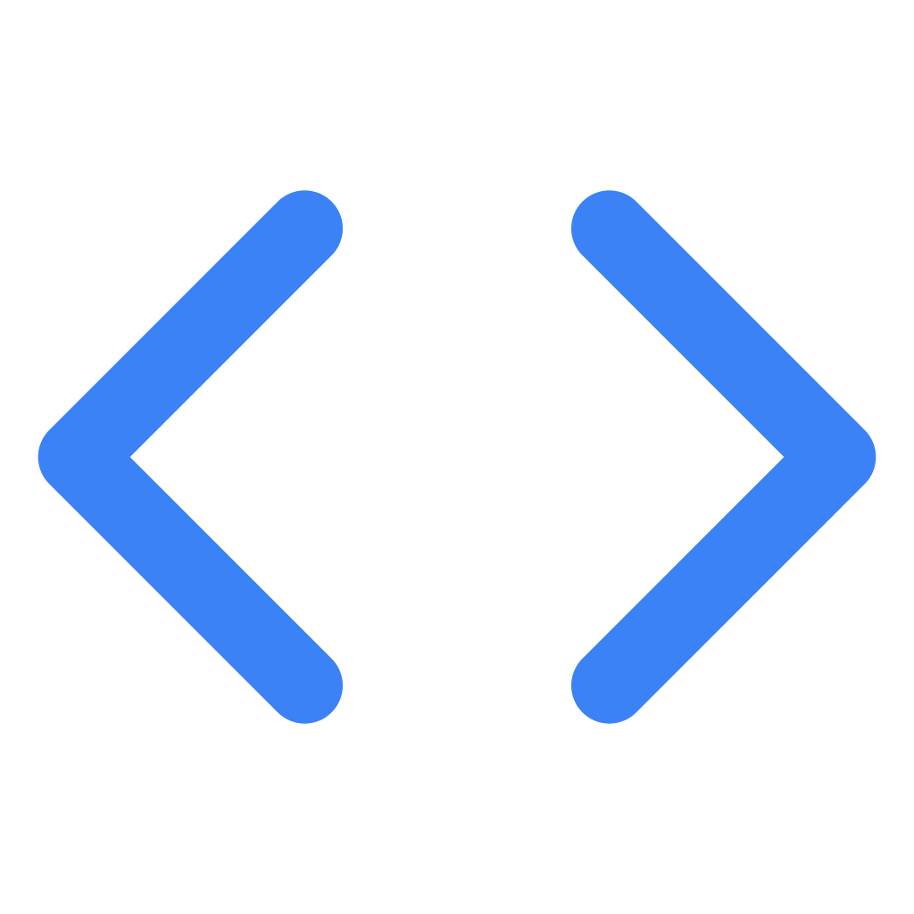

# 🔍 Stacklyzer

[](https://opensource.org/licenses/MIT)
[]()

> A comprehensive ecosystem for detecting technologies used on websites. Open source and free to use.

<div align="center">
  
  <br>
  <h3>Stacklyzer - Website Technology Detector</h3>
</div>

## 🌟 Overview

Stacklyzer is an open-source website technology detection platform that helps developers, marketers, and researchers identify what technologies are being used on any website. The system analyzes websites and provides detailed insights about their tech stack, including frameworks, libraries, CMS platforms, analytics tools, and more.

## 🚀 Features

- **Comprehensive Detection**: Identifies a wide range of web technologies
- **User-Friendly Interface**: Simple and intuitive web interface for analyzing websites
- **Detailed Results**: Provides in-depth information about each detected technology
- **Confidence Scoring**: Indicates reliability of each technology detection
- **Open Source**: Completely free and open for community contributions

## 🧩 Project Structure

The Stacklyzer project is structured as a monorepo containing:

- **[Backend](/backend)**: Node.js API for detecting website technologies
- **[Frontend](/frontend)**: Next.js web application interface
- **Upcoming Components**:
  - Chrome Extension: For instant technology detection while browsing
  - Android App: Mobile interface for on-the-go website analysis
  - NPM Package: For integrating technology detection in JavaScript projects

## 📊 How It Works

1. Users enter a website URL through the Stacklyzer interface
2. The backend fetches and analyzes the website's HTML, JS, HTTP headers, and more
3. Advanced detection algorithms identify technologies using multiple signals
4. Results are categorized and presented with confidence ratings and additional details

## 🛠️ Technology Stack

- **Backend**: Node.js, Express.js
- **Frontend**: Next.js, React, Tailwind CSS
- **Deployment**: Heroku (backend), Vercel (frontend)

## 🚀 Getting Started

To run the complete Stacklyzer ecosystem locally:

### Prerequisites

- Node.js 18.x or higher
- npm or yarn

### Installation and Setup

1. Clone the repository:

   ```bash
   git clone https://github.com/zahidlatifdev/stacklyzer.git
   cd stacklyzer
   ```

2. Set up the backend:

   ```bash
   cd backend
   npm install
   npm run dev
   ```

3. Set up the frontend in a new terminal:

   ```bash
   cd frontend
   npm install
   npm run dev
   ```

4. Open your browser and navigate to:
   - Frontend: http://localhost:3000
   - Backend API: http://localhost:4000

For more detailed setup instructions, see the [backend](/backend) and [frontend](/frontend) READMEs.

## 🤝 Contributing

Contributions are welcome! Here's how you can help:

1. Fork the repository
2. Create a feature branch (`git checkout -b feature/amazing-feature`)
3. Commit your changes (`git commit -m 'Add some amazing feature'`)
4. Push to the branch (`git push origin feature/amazing-feature`)
5. Open a Pull Request

### Areas for Contribution

- Improving detection patterns for existing technologies
- Adding detection for new technologies
- Enhancing documentation
- Adding tests
- Developing the upcoming components (Chrome extension, Android app, etc.)
- UI/UX improvements

## 📝 License

This project is licensed under the MIT License - see the [LICENSE](LICENSE) file for details.

## 💖 Support the Project

Stacklyzer is 100% free and open source. If you find it useful, consider:

- Starring the repository on GitHub
- Sharing the project with others
- Contributing code or documentation
- Reporting issues or suggesting improvements

---

Made with ❤️ by [Zahid Latif](https://github.com/zahidlatifdev)
